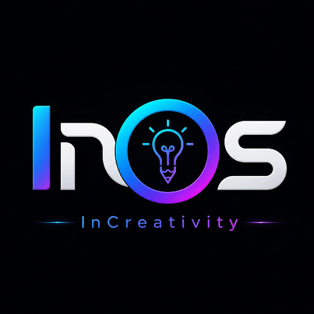

# **InOS (InCreativity OS)** 

**InOS** is a behavior-adaptive, lightweight Linux-based operating system designed to behave as a **living system manager**. Built by **InDangie Labs**, the core philosophy of the project is that the system should learn, adapt, and grow with its user.

The first release, codenamed **"School Best Mate,"** is a beginner-friendly environment optimized for student productivity, gaming, and intelligent system adaptation.

---

## **🚀 Core Vision**
InOS is designed around five intelligent principles to enhance the computing experience:
*   **Dynamic Performance:** Automatically shifts performance levels based on active needs.
*   **Load Reduction:** Pauses or removes unnecessary background processes.
*   **Productivity Boost:** Focus-oriented modes to increase workflow speed.
*   **AI Assistance:** A built-in assistant that adapts its personality and resource usage.
*   **UI Evolution:** An interface that reshapes itself based on user patterns and hardware.

---

## **🏗️ System Architecture (The 9 Layers)**
The OS utilizes a modular 9-layer stack to manage everything from the kernel to futuristic UI effects:

1.  **InOS Core Layer:** The foundation built on **Ubuntu minimal**, handling the kernel, drivers, and stability.
2.  **Smart System Layer:** Detects hardware strength at installation to assign a profile and remove bloated packages.
3.  **Smart Conserve:** A real-time runtime engine for **CPU/GPU scaling** and thermal balancing.
4.  **Smart Task System:** Switches performance profiles based on activity (e.g., **Coding, Gaming, Idle, Tinkering**).
5.  **SmartSaver:** An idle-intelligence system that cleans caches and offers a **Mini Hub** for quick access to calls, messages, and compact AI.
6.  **Visual Shell System:** Manages three distinct UI modes: **Classic** (performance-first), **Float** (layered UI), and **Holo** (glow and gradients).
7.  **Dynamic Island System:** A reactive interaction layer for notifications, music, and AI hints.
8.  **Surprise Mode:** An update-driven system to unlock seasonal themes, animations, and sound packs.
9.  **Easter Egg Event System:** Hidden visual effects and messages triggered by usage milestones.

---

## **📦 Smart Installation System**
InOS intelligently scales to fit hardware through two main installation types:

### **1. Basic Installation**
Three streamlined modes based on hardware strength: **Low** (legacy devices), **Medium** (modern balanced PCs), and **High** (gaming/advanced rigs).

### **2. Smart OS Installation**
A granular system utilizing **Device Classes** and **Levels**:
*   **Mobile & Tablet:** Levels 0–4 (Basic to Gaming).
*   **Laptop:** Levels 0–8 (Potato PC to Advanced/Gaming).
*   **Desktop:** Levels 0–10 (Low-End to modern Balanced and Gaming).
*   **Safety Feature:** Includes a **recalibration tool** that adjusts system levels automatically if you upgrade your CPU, GPU, or other components.

---

## **🧠 Local AI Ecosystem**
InOS prioritizes **privacy and responsiveness** by running Large Language Models (LLMs) locally through **Ollama**.

### **AI Behavior Modes**
The AI dynamically swaps models to balance resource usage:
*   **Compact Mode:** Uses ultra-light models like **Qwen 2.5 (0.5B)** or **Llama 3.2 (1B)** for fast status updates and system hints.
*   **Balanced Mode:** Employs **Llama 3.2 (3B)** for general productivity and study summaries.
*   **Assist Mode:** Activates advanced models like **Qwen 3 (4B-Instruct)** for proactive coding aid and complex reasoning.

### **App Interaction via MCP**
To achieve "Gemini-like" interaction with applications, InOS implements the **Model Context Protocol (MCP)**. This open-standard allows the local AI to securely interface with Linux system tools and applications.

---

## **🛠️ Software Stack**
*   **Base:** Ubuntu Minimal.
*   **Desktop Environments:** **XFCE/LXQt** (for Light builds) or **GNOME/KDE** (for High builds).
*   **Inference Engine:** **Ollama**.
*   **Voice:** **faster-whisper** for efficient local voice-to-text.
